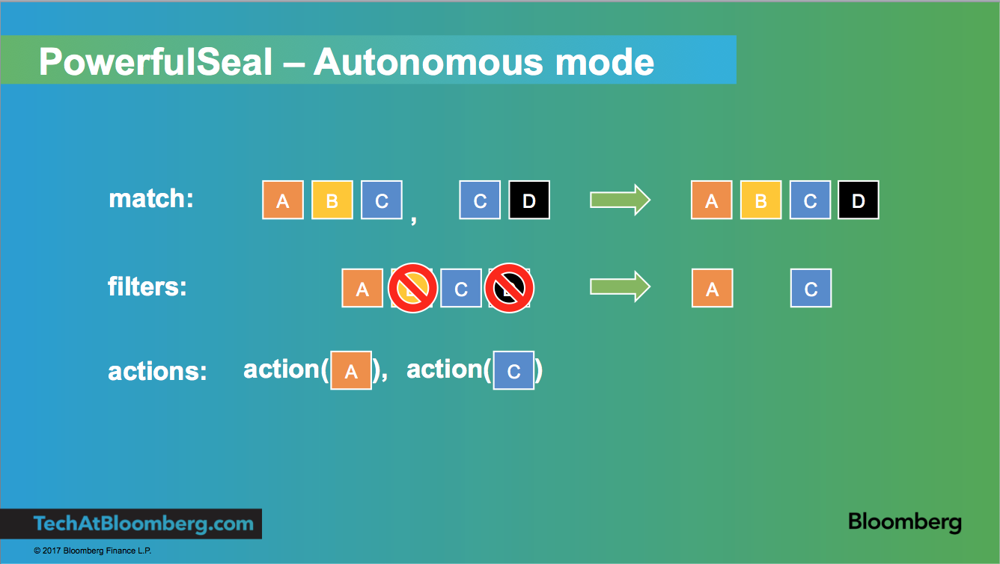
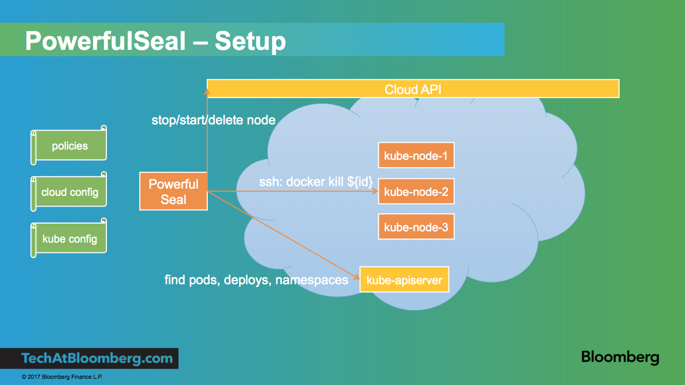

# PowerfulSeal [](https://travis-ci.org/bloomberg/powerfulseal) [](https://pypi.python.org/pypi/powerfulseal)

__PowerfulSeal__ adds chaos to your Kubernetes clusters, so that you can detect problems in your systems as early as possible. It kills targeted pods and takes VMs up and down.


It follows the [Principles of Chaos Engineering](http://principlesofchaos.org/), and is inspired by [Chaos Monkey](https://github.com/Netflix/chaosmonkey). [Watch the Seal at KubeCon 2017 Austin](https://youtu.be/00BMn0UjsG4)

Embrace the inevitable failure. __Embrace The Seal__.


## On the menu

- [Highlights](#highlights)
- [Introduction](#introduction)
- [Modes of operation](#modes-of-operation)
  - [Interactive mode](#interactive-mode)
  - [Autonomous mode](#autonomous-mode)
    - [Metrics Collection](#metrics-collection)
    - [Web user interface](#web-user-interface)
    - [Writing policies](#writing-policies)
  - [Label mode](#label-mode)
  - [Demo mode](#demo-mode)
- [Setup](#setup)
- [Getting started](#getting-started)
- [Testing](#testing)
- [Read about the PowerfulSeal](#read-about-the-powerfulseal)
- [FAQ](#faq)
- [Footnotes](#footnotes)

## Highlights

- works with `OpenStack`, `AWS` and local machines
- speaks `Kubernetes` natively
- interactive and autonomous, policy-driven mode
- web interface to interact with PowerfulSeal
- metric collection and exposition to `Prometheus`
- minimal setup, easy yaml-based policies
- easy to extend


## Introduction

__PowerfulSeal__ works in four modes: interactive, autonomous, label and demo.

__Interactive__ mode is designed to allow you to discover your cluster's components and manually break things to see what happens. It operates on nodes, pods, deployments and namespaces.

__Autonomous__ mode reads a policy file, which can contain any number of pod and node scenarios. Each scenario describes a list of matches, filters and actions to execute on your cluster, and will be executed in a loop.

__Label__ mode allows you to specify which pods to kill with a small number of options by adding `seal/` labels to pods. This is a more imperative alternative to autonomous mode.  

__Demo__ mode allows you to point the Seal at a cluster and a heapster server, it will try to figure out what to kill based on the resource utilisation.

## Modes of operation

## Interactive mode

Here's a sneak peek of what you can do in the interactive mode:


## Autonomous mode

Autonomous reads the scenarios to execute from the policy file, and runs them:

1. The matches are combined together and deduplicated to produce an initial working set
2. They are run through a series of filters
3. For all the items remaining after the filters, all actions are executed



### Metrics collection

Autonomous mode also comes with the ability for metrics useful for monitoring to be collected. PowerfulSeal currently has a `stdout` and Prometheus collector. However, metric collectors are easily extensible so it is easy to add your own. More details can be found [here](METRICS.md).

### Web user interface

PowerfulSeal comes with a web interface to help you navigate Autonomous Mode. Features include:

- starting/stopping autonomous mode
- viewing and filtering logs
- changing the configuration (either overwriting the remote policy file or copying the changes to clipboard)
- stopping/killing individual nodes and pods


### Writing policies

A minimal policy file, doing nothing, looks like this:

```yaml
config:
  minSecondsBetweenRuns: 77
  maxSecondsBetweenRuns: 100

nodeScenarios: []

podScenarios: [] 
```

The schemas are validated against the [powerful JSON schema](./powerfulseal/policy/ps-schema.json)

A [full featured example](./tests/policy/example_config.yml) listing most of the available options can be found in the [tests](./tests/policy).

## Label mode

Label mode is a more imperative alternative to autonomous mode, allowing you to specify which specific _per-pod_ whether a pod should be killed, the days/times it can be killed and the probability of it being killed.

Instructions on how to use label mode can be found in [LABELS.md](LABELS.md).


## Demo mode

The main way to use PowerfulSeal is to write a policy file for Autonomous mode which reflects realistic failures in your system. However, PowerfulSeal comes with a demo mode to demonstrate how it can cause chaos on your Kubernetes cluster. Demo mode gets all the pods in the cluster, selects those which are using the most resources, then kills them based on a probability.

Demo mode requires [Heapster](https://github.com/kubernetes/heapster). To run demo mode, use the `--demo` flag along with `--heapster-path` (path to heapster without a trailing slash, e.g., `http://localhost:8001/api/v1/namespaces-kube-system/services/heapster/proxy`). You can also optionally specify `--aggressiveness` (from `1` (weakest) to `5` (strongest)) inclusive, as well as `--[min/max]-seconds-between-runs`.


## Setup

Setup includes:
- pointing PowerfulSeal at your Kubernetes cluster by giving it a Kubernetes config file
- pointing PowerfulSeal at your cloud by specifying the cloud driver to use and providing credentials
- making sure that PowerfulSeal can SSH into the nodes to execute commands on them
- writing a set of policies

These interactions are available:



## Getting started

`PowerfulSeal` is available to install through pip:

```sh
pip install powerfulseal
powerfulseal --help # or seal --help
```

To start the web interface, use flags `--server --server-host [HOST] --server-port [PORT]` when starting PowerfulSeal in autonomous mode and visit the web server at `http://HOST:PORT/`.

Both Python 2.7 and Python 3 are supported.

## Testing

PowerfulSeal uses [tox](https://github.com/tox-dev/tox) to test with multiple versions on Python. The recommended setup is to install and locally activate the Python versions under `tox.ini` with [pyenv](https://github.com/pyenv/pyenv). 

Once the required Python versions are set up and can be discovered by tox (e.g., by having them discoverable in your PATH), you can run the tests by running `tox`.

For testing the web server and more details on testing, see [TESTING.md](TESTING.md). 

## Read about the PowerfulSeal

- https://www.techatbloomberg.com/blog/powerfulseal-testing-tool-kubernetes-clusters/
- https://siliconangle.com/blog/2017/12/17/bloomberg-open-sources-powerfulseal-new-tool-testing-kubernetes-clusters/
- https://github.com/ramitsurana/awesome-kubernetes#testing
- https://github.com/ramitsurana/awesome-kubernetes#other-useful-videos
- https://github.com/dastergon/awesome-chaos-engineering#notable-tools
- https://www.linux.com/news/powerfulseal-testing-tool-kubernetes-clusters-0
- https://www.infoq.com/news/2018/01/powerfulseal-chaos-kubernetes

## FAQ

### Where can I learn more about Chaos Engineering ?

We found these two links to be a good start:

- http://principlesofchaos.org/
- https://github.com/dastergon/awesome-chaos-engineering

### How is it different from Chaos Monkey ?

PowerfulSeal was inspired by Chaos Monkey, but it differs in a couple of important ways.

The Seal does:
  - speak Kubernetes
  - offer flexible, easy to write YAML scenarios
  - provide interactive mode with awesome tab-completion

The Seal doesn't:
  - need external dependencies (db, Spinnaker), apart from SSH, cloud and Kubernetes API access
  - need you to setup ```cron```

### Can I contribute to The Seal ?

We would love you to. In particular, it would be great to get help with:

- get more [cloud drivers](./powerfulseal/clouddrivers/driver.py) (currently `OpenStack` and `AWS`)
- get more [awesome filters](./powerfulseal/policy/scenario.py)
- <del>__get an amazing logo__</del>
- make the PowerfulSeal more powerful

Check out our [CONTRIBUTING.md](CONTRIBUTING.md) file for more information about how to contribute.

### Why a Seal ?

It might have been inspired by [this comic](https://randowis.com/2015/01/07/the-tower/).


## Footnotes

PowerfulSeal logo Copyright 2018 The Linux Foundation, and distributed under the Creative Commons Attribution (CC-BY-4.0) [license](https://creativecommons.org/licenses/by/4.0/legalcode).
