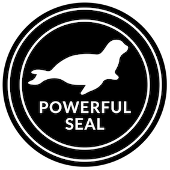

{:class="img-responsive" width="150px"}

# A powerful chaos engineering tool for Kubernetes clusters
{: .fs-9 }

**PowerfulSeal** injects failure into your Kubernetes clusters, so that you can detect problems as early as possible. It allows for writing scenarios describing complete [chaos experiments](https://principlesofchaos.org).
{: .fs-6 .fw-300 }

[Get started now](./getting-started){: .btn .btn-primary .fs-5 .mb-4 .mb-md-0 .mr-2 } [View it on GitHub](https://github.com/bloomberg/powerfulseal){: .btn .fs-5 .mb-4 .mb-md-0 }

---


## Highlights

- works with `kubernetes`, `OpenStack`, `AWS`, `Azure`, `GCP` and local machines
- `Prometheus` and `Datadog` metrics collection
- `yaml` [policies](#policies) describing chaos experiments
- multiple [modes](./modes)

---

## Policies

Just to give you a taste, here's an example policy. It will kill a single pod, and then check that the service continues responding to HTTP probes, to verify its resiliency to one of its pods going down.

```yaml
scenarios:
- name: Kill one pod in my namespace, make sure the service responds
  steps:
  # kill a pod from `myapp` namespace
  - podAction:
      matches:
        - namespace: myapp
      filters:
        - randomSample:
            size: 1
      actions:
        - kill:
            probability: 0.75
  # check my service continues working
  - probeHTTP:
      target:
        service:
          name: my-service
          namespace: myapp
      endpoint: /healthz
```

[Learn how to write your own policies](./policies){: .btn .btn-primary .fs-5 .mb-4 .mb-md-0 .mr-2 }

---

### License

Powerfulseal is distributed by an [Apache-2.0](https://github.com/bloomberg/powerfulseal/blob/master/LICENSE).

